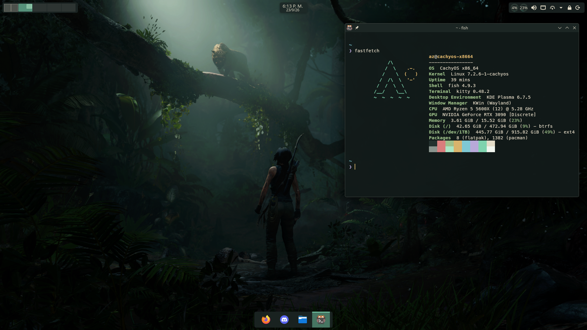

# Kzito

**Rice minimalista para KDE Plasma 6 · píldoras flotantes · Jade / Stone / Antique Gold**

[](https://archlinux.org)
[](https://fedoraproject.org)
[](https://cachyos.org)
[](https://kde.org)
[](https://www.gnu.org/software/bash/)

## Capturas



## Qué incluye

| Apartado | Detalle |
| --- | --- |
| Barras | 3 píldoras flotantes translúcidas arriba (pager, reloj+fecha, CPU/RAM+bandeja) + dock abajo |
| Tema | LaraCraft propio (Breeze + paleta jade/piedra/oro) · KWin blur + dim |
| Iconos | Papirus-Dark con carpetas verdes |
| GTK | Colloid verde oscuro (apps y Firefox) |
| Terminales | Konsole, Alacritty, Kitty `#121A19` Meslo Nerd, fastfetch + Starship |
| Login | Fondo Tomb Raider en `/usr/share/wallpapers` (elegilo en Ajustes) |
| Extras | Betterfox descargado, wallpaper Tomb Raider |

## Instalar (Arch/CachyOS o Fedora)

```
git clone https://github.com/AZIT0/Kzito;
cd Kzito;
./install.sh
```

El script es 100% shell (Chaotic-AUR solo en Arch). Al terminar: cerrar sesión y entrar.

## Requisitos

Plasma 6, `sudo`, internet. Probado en CachyOS; Fedora soportado.

## Desinstalar

```
cd Kzito; ./rice-uninstall.sh
```

Devuelve KDE a fábrica Breeze oscuro y borra todo lo instalado.
Sin backup: no hay vuelta atrás.

## Atajos

| Teclas | Acción |
| --- | --- |
| `Super+Enter` / `Super+E` / `Super+W` | Terminal / Archivos / Navegador |
| `Super+Q` / `Super+Shift+Q` | Cerrar / Matar ventana |
| `Super+F` | Fullscreen |
| `Super` | KRunner |
| `Super+1..0` | Ir a escritorio |
